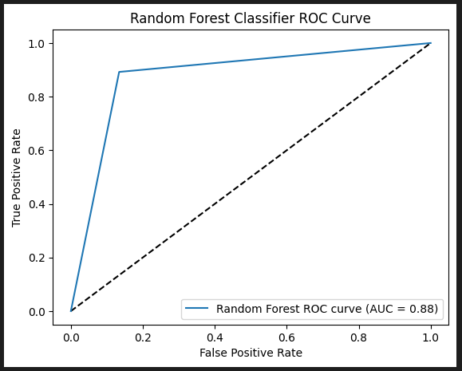
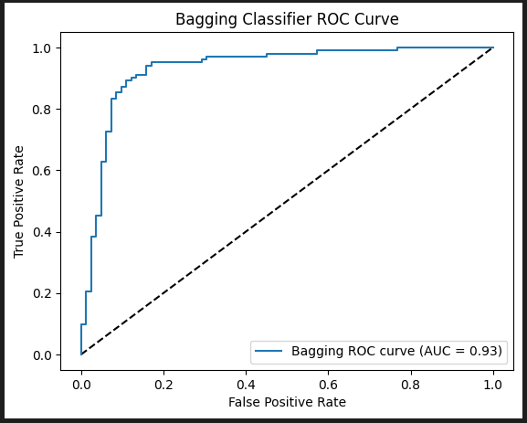
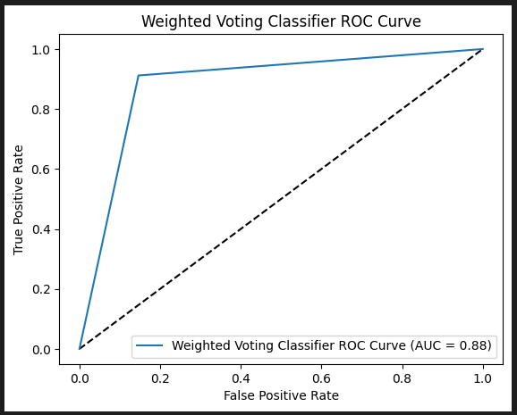
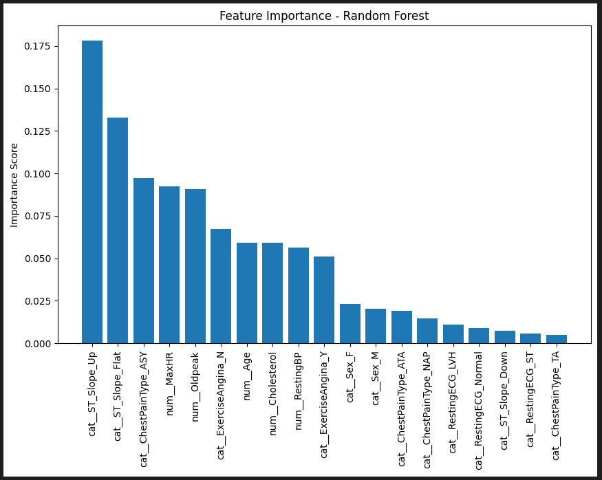

# Heart Disease Risk Prediction (Machine Learning)
**Project by Brian Benitez **  
**Published MAY 2024**

**Project Type:** Machine Learning / Data engineering

**Tools Used:** Python (Pandas, numpy, matplot, sklearn), Model training and evaluation, Model Improvements, Model Comparison and Interpretation

**Dataset Size:** 918 Patients  

## Introduction
Heart disease is a major health risk, and early identification can help support preventative care.  
This project builds and compares multiple machine learning classifiers to predict whether a patient is likely to have heart disease (`HeartDisease = 1`) based on clinical and exercise-related features.

This is a **binary classification** problem. The notebook focuses on:
- Data preprocessing (including handling suspicious zero-values)
- Training baseline models
- Training + tuning ensemble models
- Comparing models using multiple evaluation metrics (Accuracy, Precision, Recall, F1, ROC-AUC)

## Dataset
The project uses the included dataset: `heart.csv`

- Rows: **918**
- Target: **HeartDisease** (0 or 1)
- Features include a mix of numerical and categorical fields such as:
  - Numerical: `Age`, `RestingBP`, `Cholesterol`, `MaxHR`, `Oldpeak`, `FastingBS`
  - Categorical: `Sex`, `ChestPainType`, `RestingECG`, `ExerciseAngina`, `ST_Slope`

## Methodology

### 1) Data preprocessing
Key preprocessing steps in the notebook:
- **Invalid / placeholder zero handling:** `RestingBP` and `Cholesterol` contain many `0` values (not physiologically plausible), so the notebook replaces 0’s with the **median** value for each column.
- **Train/test split:** 80% train / 20% test
- **Encoding + scaling (via Pipeline):**
  - Categorical features: **OneHotEncoder**
  - Numerical features: **StandardScaler**
  - Combined using **ColumnTransformer** inside a **Pipeline** to avoid leakage

### 2) Baseline models trained
- Logistic Regression
- MLP (Neural Network)
- Gaussian Naive Bayes
- SVM (Linear kernel)
- Decision Tree

### 3) Ensemble models + improvements
- Bagging (Decision Tree base estimator)
- AdaBoost
- Random Forest
- XGBoost (trained in notebook)
- **GridSearchCV** hyperparameter tuning (LogReg, Bagging, AdaBoost, Random Forest)
- Feature selection experiment using **RFE**
- A final **Weighted Voting Classifier** combining strong models

## Results

### Baseline snapshot (test set)
- Logistic Regression achieved **~0.88 accuracy**
- MLP achieved **~0.80 accuracy**
- Naive Bayes achieved **~0.84 accuracy**
- SVM (linear) achieved **~0.76 accuracy**
- Decision Tree achieved **~0.75 accuracy**

### Top models comparison (test set)
| Model           | Accuracy | Precision | Recall | F1-Score | ROC-AUC |
|----------------|----------|-----------|--------|----------|--------:|
| Random Forest  | 0.8804   | 0.8922    | 0.8922 | 0.8922   | 0.9259 |
| Bagging        | 0.8804   | 0.8774    | 0.9118 | 0.8942   | 0.9314 |
| Weighted Voting| 0.8859   | 0.8857    | 0.9118 | 0.8986   | 0.9264 |

  
  
  

**Takeaway:**  
- **Best accuracy:** Weighted Voting (**0.8859**)  
- **Best ROC-AUC:** Bagging (**0.9314**)  
- Random Forest and Bagging are very competitive, with strong overall balance.

## Discussion of Key Findings
- Simpler models (like Logistic Regression) performed surprisingly well, suggesting the dataset contains strong signal and fairly learnable boundaries after preprocessing.
- Ensembles improved robustness and overall performance, especially when balancing precision/recall tradeoffs.
- ROC-AUC comparisons suggest Bagging and Random Forest are strong choices when you care about ranking/risk scoring, not just hard 0/1 predictions.

  
  
## Conclusion
This project demonstrates an end-to-end classification workflow:
- Clean preprocessing with pipelines (encoding + scaling)
- Strong baselines + multiple ensembles
- Hyperparameter tuning (GridSearchCV)
- Model comparison using Accuracy, F1, and ROC-AUC
- Final model selection using a voting ensemble
